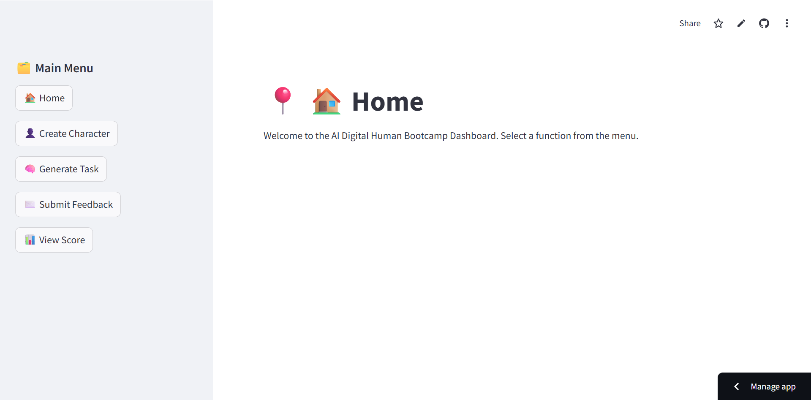
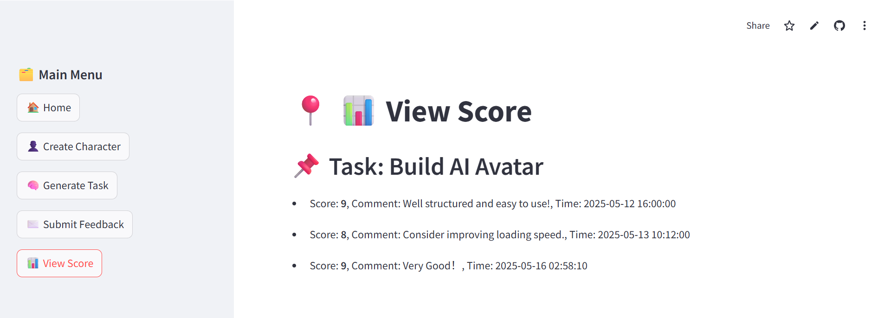

# 🧠 AI Digital Human Bootcamp

A clean, modular dashboard simulating the growth process of an AI-driven digital human.  
This project is built to showcase hands-on skills in state management, component separation, interaction design, and deployable UI logic.

---

## Live Demo

▶️ [Launch the app](https://ai-digital-human-3va4hftrfzyrygev9lzu6u.streamlit.app/)

---

## Features at a glance

> In short: every click updates the system, and every task is tracked — nothing is static.

- 🧍 Role switching (User / Mentor / Admin) — logic-ready for permission-based views  
- ✅ Task generation, progress marking, and persistent tracking  
- ✉️ Feedback submission with scoring and comments  
- 🏆 Achievement logic built in (badge visuals coming in v2)  
- 📊 Visualization and AI-generated summaries planned in v2  
- ☁️ Cloud deployable, or runnable locally with one command  

---

## Screenshots

| Dashboard | Create Character |
|-----------|------------------|
|  |  |

| Task List | Submit Feedback |
|-----------|-----------------|
|  |  |

| View Score | *(Achievement Coming Soon)* |
|------------|-----------------------------|
|  | *(screenshot6_achievement_text.png)* |

---

## Tech Stack

- **Frontend:** Streamlit + Plotly (planned)
- **Data storage:** JSON files (task/feedback)
- **AI module (planned):** OpenAI API for daily reflections
- **Backend architecture (scaffolded):** FastAPI + modular routing (currently unused)
---

## Run Locally

```
bash
streamlit run app_main_hub_cards.py

```

## Project Structure
.
├── app_main_hub_cards.py      # Main UI script
├── feedback_data.json         # Feedback storage
├── task_data.json             # Task tracking
├── backend/                   # FastAPI routing logic (for future)
├── .streamlit/config.toml     # Deployment config
├── requirements.txt

```

```
## Note from the developer

This project started out as a quick mockup of an “AI trainee simulation” but evolved into a fully interactive frontend. I kept the interface clean, data persistent, and logic modular — so it’s both demo-ready and easy to iterate.

If you're a hiring manager or interviewer, everything you see here is real:
clickable, stateful, and designed with product thinking.
